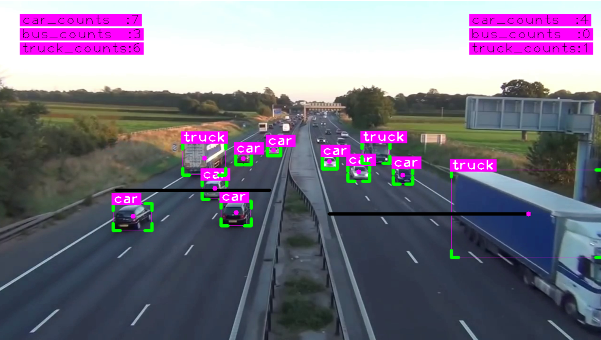
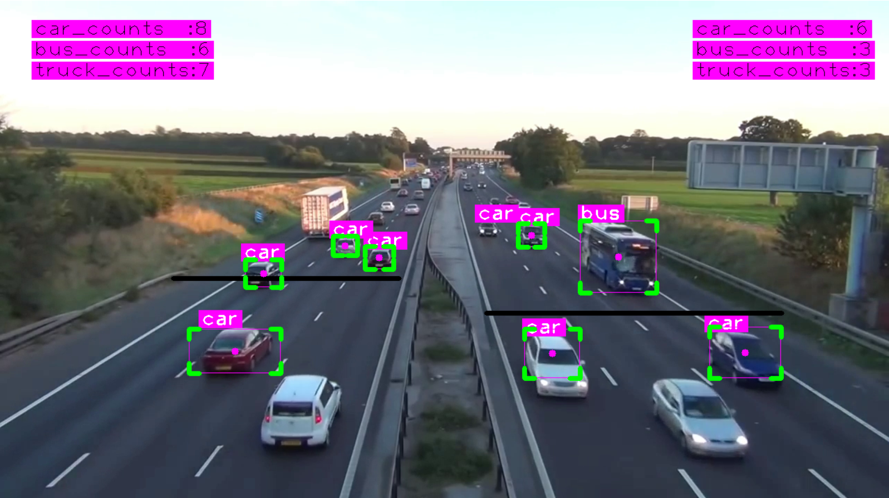

# Vehicle Counting

Professional vehicle counting system using **YOLOv8** and the **SORT** (Simple Online and Realtime Tracking) algorithm.

This project detects and counts vehicles (cars, buses, trucks, and motorbikes) moving in two directions on a road. A binary mask is applied to restrict detection only to the road area, improving both accuracy and performance.

## Demo

### Detection & Counting Results

**Figure 1**



**Figure 2**



## Features

- Real-time vehicle detection using YOLOv8
- Multi-object tracking with SORT algorithm (Kalman Filter + Hungarian Algorithm)
- Separate counting for vehicles moving **Up** and **Down**
- Class-wise counting (Car, Bus, Truck)
- Region of Interest (ROI) masking to ignore irrelevant areas
- Visual display of bounding boxes, tracking IDs, and live counters

## Project Structure

```text
Vehicle-Counting/
├── main.py                  # Main application
├── sort.py                  # SORT tracking algorithm
├── mask.png                 # Binary mask for ROI
├── screenshots/
│   ├── fig_1.png
│   └── fig_2.png
├── model/                   # Create this folder and place models here
└── README.md
```

## Installation

```bash
pip install ultralytics opencv-python cvzone filterpy scikit-image lap
```

### Model Setup (Important)

1. Create a folder named `model` in the project root.
2. Download the YOLOv8 model and place it inside the `model` folder:

- Recommended model: `yolov8s.pt`

After downloading, your structure should look like this:

```text
model/
└── yolov8s.pt
```

## How It Works

### 1. Detection

YOLOv8 detects vehicles in each frame. Only the following classes are kept:

- car
- bus
- truck
- motorbike

Detections with confidence lower than `0.4` are filtered out.

### 2. Region of Interest (Mask)

A binary mask (`mask.png`) is applied using a bitwise AND operation. This ensures that only the road area is processed, reducing false detections from sidewalks, buildings, or other irrelevant objects.

### 3. Tracking

The **SORT** algorithm is used for multi-object tracking:

- Predicts object positions using a Kalman Filter
- Associates detections across frames using the Hungarian Algorithm (based on IoU)
- Assigns a unique and consistent ID to each vehicle

### 4. Counting Logic

Two virtual lines are defined:

- **Up Line:** `[250, 400, 575, 400]`
- **Down Line:** `[700, 450, 1125, 450]`

When the center point of a tracked vehicle crosses a line, it is counted in the corresponding direction and class.

## Configuration

You can modify these parameters in `main.py`:

| Parameter | Description | Default Value |
|-----------|-------------|---------------|
| `limitsUp` | Coordinates of the Up counting line | `[250, 400, 575, 400]` |
| `limitsDown` | Coordinates of the Down counting line | `[700, 450, 1125, 450]` |
| `Confidence Threshold` | Minimum detection confidence | `0.4` |
| `max_age (SORT)` | Max frames to keep a lost track | `20` |
| `min_hits (SORT)` | Minimum hits before confirming a track | `3` |
| `iou_threshold (SORT)` | IoU threshold for matching | `0.3` |

## How to Run

1. Place your video file in the appropriate path (update the path in `main.py` if needed).
2. Make sure `yolov8s.pt` is inside the `model/` folder.
3. Make sure `mask.png` is in the project root.
4. Run the script:

```bash
python main.py
```

## Output

- Live video window showing:
  - Bounding boxes with class labels
  - Tracking center points
  - Real-time counters for Car, Bus, and Truck (both directions)
- Separate counts for vehicles moving Up and Down

## Technical Notes

- The system uses `cvzone` for better visual rendering of bounding boxes and text.
- SORT is preferred over DeepSORT for higher speed when appearance features are not critical.
- The ROI mask significantly reduces computational load and false positives.

## Use Cases

- Traffic flow analysis
- Smart city monitoring systems
- Intersection vehicle counting
- Transportation research and planning

## Author

**Mohammad Hashemzadeh**

CEO & AI Specialist at Hooshmand Mobtakeran Novin Alborz

Computer Vision & LLM Systems
